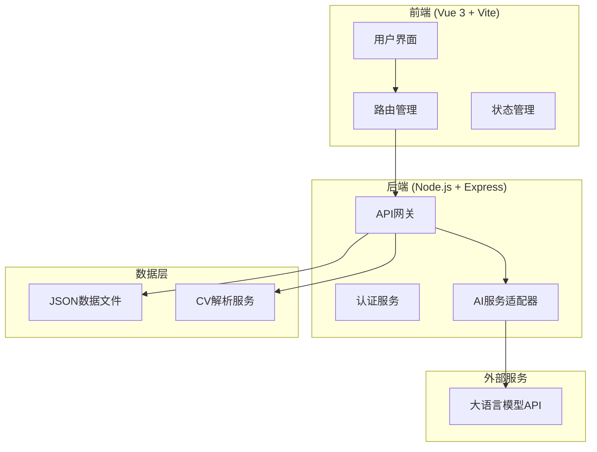
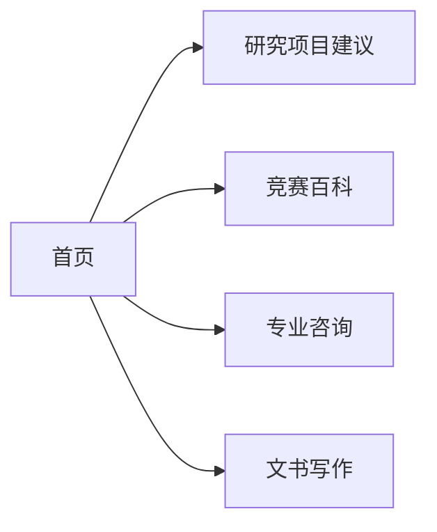

# Ginkoo.org 留学咨询网站

Feature Name: ginkoo-website
Updated: 2026-03-10

## Description

Ginkoo.org是一个留学咨询网站，包含四个核心模块：
1. 学生定制化研究项目建议 - 根据用户输入生成4个研究项目建议
2. 竞赛百科书 - 查询各学科国际竞赛信息
3. 大学专业咨询 - 查询大学专业相关信息
4. 文书写作辅助 - 根据CV生成个人陈述

## Architecture

### System Architecture



### Module Structure



## Components and Interfaces

### 前端组件

| 组件名称 | 功能 | 位置 |
|---------|------|------|
| NavBar | 导航栏组件 | components/NavBar.vue |
| HomePage | 首页 | views/HomePage.vue |
| ResearchProjectView | 研究项目建议页面 | views/ResearchProjectView.vue |
| CompetitionView | 竞赛百科页面 | views/CompetitionView.vue |
| MajorView | 专业咨询页面 | views/MajorView.vue |
| EssayView | 文书写作页面 | views/EssayView.vue |
| InputForm | 通用输入表单组件 | components/InputForm.vue |
| ResultCard | 结果展示卡片 | components/ResultCard.vue |

### 后端API接口

| 接口路径 | 方法 | 功能 |
|---------|------|------|
| /api/research/suggest | POST | 生成研究项目建议 |
| /api/competition/search | GET | 搜索竞赛信息 |
| /api/competition/:id | GET | 获取竞赛详情 |
| /api/major/:name | GET | 查询专业信息 |
| /api/essay/generate | POST | 生成个人陈述 |
| /api/upload/cv | POST | 上传CV文件 |

### 数据模型

#### 研究项目建议输入

```typescript
interface ResearchInput {
  majorDirection: string;      // 目标专业方向
  personalBackground: string;  // 个人背景
  hobbies: string;            // 爱好
  habits: string;             // 习惯
}
```

#### 研究项目建议输出

```typescript
interface ResearchSuggestion {
  title: string;              // 项目标题
  description: string;        // 项目描述
  requiredSkills: string[];   // 所需技能
  expectedOutcomes: string;   // 预期成果
  timeline: string;           // 推荐时间线
}
```

#### 竞赛信息

```typescript
interface Competition {
  id: string;
  name: string;              // 竞赛名称
  subject: string;           // 学科
  organizer: string;          // 主办方
  format: string;             // 比赛形式
  dates: string;              // 关键日期
  eligibility: string;        // 参赛资格
  knowledgeScope: string[];   // 知识范围
  pastPapers: Paper[];        // 历年题目
}
```

#### 专业信息

```typescript
interface MajorInfo {
  name: string;
  requiredSubjects: string[];     // 高中必学科目
  typicalCourses: string[];       // 典型课程
  employmentDirections: string[]; // 就业方向
  knownCompanies: string[];       // 知名公司
  researchAreas: string[];        // 研究领域
}
```

#### 文书输入

```typescript
interface EssayInput {
  cvFile: File;               // CV文件
  targetSchool?: string;      // 目标学校（可选）
  targetMajor: string;        // 目标专业（必填）
  wordCount: number;          // 字数范围
  additionalRequirements?: string; // 其他要求
}
```

## Correctness Properties

1. 每个模块的输入必须验证必填字段
2. 生成的内容必须与用户输入的专业方向相关
3. CV文件只支持PDF和DOCX格式，大小不超过10MB
4. 生成的个人陈述必须在指定的字数范围内
5. 页面加载时间不超过3秒
6. API响应时间不超过30秒

## Error Handling

| 场景 | 处理方式 |
|------|----------|
| 输入验证失败 | 显示清晰的错误提示信息 |
| 文件上传失败 | 显示错误消息并提供重试选项 |
| API调用超时 | 显示超时提示并提供重试按钮 |
| 不支持的学科/专业 | 显示友好的"暂无数据"提示 |
| 文件格式错误 | 提示支持的文件格式 |

## Test Strategy

### 前端测试
- 组件渲染测试
- 表单验证测试
- 响应式布局测试

### 后端测试
- API接口测试
- 文件上传测试
- 输入验证测试

### 集成测试
- 端到端流程测试
- 各模块功能测试

## References

[^1]: Vue 3 官方文档 - https://vuejs.org/
[^2]: Vite 构建工具 - https://vitejs.dev/
[^3]: Node.js 官方文档 - https://nodejs.org/
